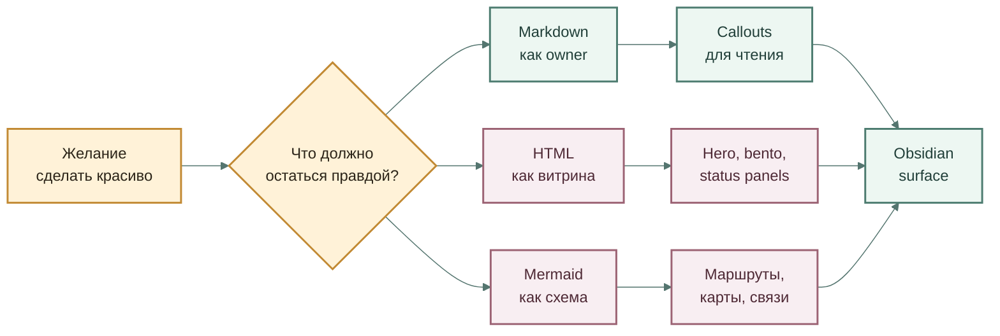
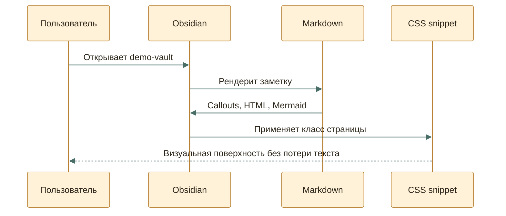

---
aliases:
  - Obsidian Beauty Lab
tags:
  - experiment/obsidian
cssclasses:
  - obsidian-beauty-lab
---

# Obsidian Beauty Lab

Markdown + HTML + Mermaid

<h2 style="margin: 16px 0 8px; max-width: 760px; font-size: 44px; line-height: 1.02; color: #26221b;">Одна заметка как живая проектная поверхность</h2>

Ниже смешаны нативные callouts, переносимый Markdown, встроенный HTML и Mermaid-схемы. Без CSS это остаётся читаемой заметкой; с CSS snippet превращается в аккуратную Obsidian-страницу.

calloutsHTMLMermaidCanvas

## Быстрый Осмотр

<strong style="color:#3b3124;">Нативная база</strong> Callouts, headings, links and properties остаются обычным Markdown-слоем.

<strong style="color:#244942;">HTML-витрина</strong> Inline HTML даёт hero, сетки, бейджи и компактные панели без отдельного сайта.

<strong style="color:#56303d;">Mermaid-сцены</strong> Схемы можно сделать мягче через themeVariables, classDef и короткие подписи.

<strong style="color:#303a67;">CSS snippet</strong> Красота живёт снаружи заметки, а не ломает смысловой Markdown.

> [!summary]+ Смысл демо
> **Цель:** показать верхнюю границу красивой Obsidian-заметки, которая всё ещё
> остаётся читаемой в git, терминале и Codex.
>
> Лучший путь — не “весь HTML”, а связка: короткая Markdown-структура,
> нативные callouts, точечный HTML для витринных блоков и CSS snippet для
> визуального слоя.

> [!warning]- Где HTML становится плохой идеей
> Если важный смысл живёт только внутри большого HTML-блока, будущий агент или
> человек хуже его редактирует. HTML здесь годится как витрина, но не как
> единственный источник правды.

> [!tip]- Что делает CSS snippet
> Snippet из `snippets/obsidian-beauty-lab.css` усиливает только заметки с
> `cssclasses: obsidian-beauty-lab`: расширяет страницу, смягчает callouts,
> добавляет тени, меняет Mermaid-контейнер и делает hero/bento чище.

## Mermaid: Маршрут Решения

## Mermaid: Сценарий Сессии

## AtlasGrid: Квадратный SVG

> [!example]+ Что получилось лучше Mermaid
> Здесь диаграмма не тянется строго слева направо. `AtlasGrid` через `elkjs`
> раскладывает граф, выбирает вариант ближе к квадрату, а Obsidian получает
> обычный SVG-файл.

![[generated/elk-square-demo.svg|720]]

## SkillMap: D2 Без Самописной Типографики

> [!example]+ Что проверяем
> `SkillMap` описывает работу `1*`-скилов в D2. Здесь renderer сам берёт на
> себя тему, карточки, подписи и SVG-export.

![[generated/skillmap.svg|720]]

## InstructionMap: Подробный D2-Граф

> [!example]+ Что проверяем
> `InstructionMap` показывает, как D2 держит контейнеры, длинные текстовые
> блоки, разные формы и подписи на связях в одной объясняющей схеме.

![[generated/instruction-map.svg|720]]

## FlowPage: React Flow + ELK

> [!example]+ Что проверяем
> Если карта должна зумиться и двигаться как рабочая поверхность, её лучше
> вынести в отдельную страницу. `FlowPage` оставляет Obsidian входом, а
> интерактивность отдаёт React Flow.

[Открыть FlowPage](http://127.0.0.1:5173/flowpage.html)

## HTML: Маленький Пульт

Status

Beautiful but still readable

Главная проверка: если CSS выключить, заметка не должна развалиться в мусор.

<strong>Owner</strong> Markdown

<strong>Display</strong> Obsidian preview

<strong>Risk</strong> HTML drift

## Слои

> [!example]+ Слой 1: обычный Markdown
> - Заголовки дают каркас.
> - Списки дают сканируемость.
> - Wikilinks и Markdown-ссылки дают навигацию.
> - Frontmatter даёт свойства, но не должен плодить новые типы данных без owner.

> [!example]+ Слой 2: Obsidian callouts
> Callouts хороши тем, что они нативные, сворачиваемые и всё ещё читаются как
> текст. Это лучший default для красивой рабочей заметки.

> [!example]+ Слой 3: HTML-вставки
> HTML лучше использовать для витринных блоков: hero, карточки, статусы,
> компактные панели. Не стоит прятать в нём правила, критерии или единственную
> версию важного решения.

> [!example]+ Слой 4: CSS snippet
> CSS должен усиливать уже понятную структуру. Если без CSS заметка теряет
> смысл, значит красота стала вторым источником правды.

## Мини-Детали

Почему это не отдельный сайт

Obsidian хорош, когда рабочая заметка остаётся заметкой: её можно читать в git, менять обычным редактором и связывать с другими файлами. Сайт красивее контролирует пиксели, но дороже поддерживается.

Где предел

Сложные интерактивные элементы, JavaScript, полноценные формы и состояние лучше выносить из заметки. В Obsidian их можно имитировать, но это быстро становится хрупким.

## Связанные Файлы

- [[README|README эксперимента]]
- [[01-beauty-board.canvas|Canvas-доска]]
- [[02-iframe-and-clever-paths|Iframe и хитрые пути]]
- [[03-meta-bind-and-obsidian-primitives|Meta Bind и Obsidian-примитивы]]
- [[04-custom-js-diagram|Кастомная JS-диаграмма]]
- [[05-elk-square-svg|AtlasGrid]]
- [[06-skillmap-d2|SkillMap]]
- [[07-instruction-map-d2|InstructionMap]]
- [[08-flowpage-react-flow-elk|FlowPage]]
- [[iframe-and-html.base|Base-вид]]
- `snippets/obsidian-beauty-lab.css`
