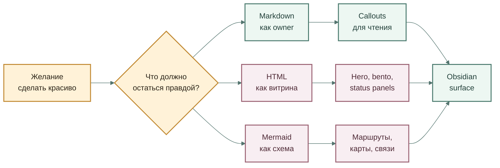
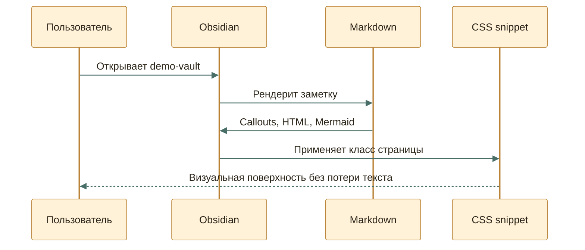

---
aliases:
  - Obsidian Beauty Lab
cssclasses:
  - obsidian-beauty-lab
---

# Obsidian Beauty Lab

Markdown + HTML + Mermaid

### Одна заметка как живая проектная поверхность

Ниже смешаны нативные callouts, переносимый Markdown, встроенный HTML и Mermaid-схемы. Без CSS это остаётся читаемой заметкой; с CSS snippet превращается в аккуратную Obsidian-страницу.

calloutsHTMLMermaidCanvas

## Быстрый Осмотр

**Нативная база**\
Callouts, headings, links and properties остаются обычным Markdown-слоем.**HTML-витрина**\
Inline HTML даёт hero, сетки, бейджи и компактные панели без отдельного сайта.**Mermaid-сцены**\
Схемы можно сделать мягче через themeVariables, classDef и короткие подписи.**CSS snippet**\
Красота живёт снаружи заметки, а не ломает смысловой Markdown.

> \[!summary]+ Смысл демо **Цель:** показать верхнюю границу красивой Obsidian-заметки, которая всё ещё остаётся читаемой в git, терминале и Codex.
>
> Лучший путь — не “весь HTML”, а связка: короткая Markdown-структура, нативные callouts, точечный HTML для витринных блоков и CSS snippet для визуального слоя.

> \[!warning]- Где HTML становится плохой идеей Если важный смысл живёт только внутри большого HTML-блока, будущий агент или человек хуже его редактирует. HTML здесь годится как витрина, но не как единственный источник правды.

> \[!tip]- Что делает CSS snippet Snippet из `snippets/obsidian-beauty-lab.css` усиливает только заметки с `cssclasses: obsidian-beauty-lab`: расширяет страницу, смягчает callouts, добавляет тени, меняет Mermaid-контейнер и делает hero/bento чище.

## Mermaid: Маршрут Решения

## Mermaid: Сценарий Сессии

## AtlasGrid: Квадратный SVG

> \[!example]+ Что получилось лучше Mermaid Здесь диаграмма не тянется строго слева направо. `AtlasGrid` через `elkjs` раскладывает граф, выбирает вариант ближе к квадрату, а Obsidian получает обычный SVG-файл.

!\[\[generated/elk-square-demo.svg|720]]

## SkillMap: D2 Без Самописной Типографики

> \[!example]+ Что проверяем `SkillMap` описывает работу `1*`-скилов в D2. Здесь renderer сам берёт на себя тему, карточки, подписи и SVG-export.

!\[\[generated/skillmap.svg|720]]

## InstructionMap: Подробный D2-Граф

> \[!example]+ Что проверяем `InstructionMap` показывает, как D2 держит контейнеры, длинные текстовые блоки, разные формы и подписи на связях в одной объясняющей схеме.

!\[\[generated/instruction-map.svg|720]]

## FlowPage: React Flow + ELK

> \[!example]+ Что проверяем Если карта должна зумиться и двигаться как рабочая поверхность, её лучше вынести в отдельную страницу. `FlowPage` оставляет Obsidian входом, а интерактивность отдаёт React Flow.

[Открыть FlowPage](http://127.0.0.1:5173/flowpage.html)

## HTML: Маленький Пульт

StatusBeautiful but still readable

Главная проверка: если CSS выключить, заметка не должна развалиться в мусор.

**Owner**\
Markdown**Display**\
Obsidian preview**Risk**\
HTML drift

## Слои

> \[!example]+ Слой 1: обычный Markdown
>
> * Заголовки дают каркас.
> * Списки дают сканируемость.
> * Wikilinks и Markdown-ссылки дают навигацию.
> * Frontmatter даёт свойства, но не должен плодить новые типы данных без owner.

> \[!example]+ Слой 2: Obsidian callouts Callouts хороши тем, что они нативные, сворачиваемые и всё ещё читаются как текст. Это лучший default для красивой рабочей заметки.

> \[!example]+ Слой 3: HTML-вставки HTML лучше использовать для витринных блоков: hero, карточки, статусы, компактные панели. Не стоит прятать в нём правила, критерии или единственную версию важного решения.

> \[!example]+ Слой 4: CSS snippet CSS должен усиливать уже понятную структуру. Если без CSS заметка теряет смысл, значит красота стала вторым источником правды.

## Мини-Детали

Почему это не отдельный сайт

Obsidian хорош, когда рабочая заметка остаётся заметкой: её можно читать в git, менять обычным редактором и связывать с другими файлами. Сайт красивее контролирует пиксели, но дороже поддерживается.

Где предел

Сложные интерактивные элементы, JavaScript, полноценные формы и состояние лучше выносить из заметки. В Obsidian их можно имитировать, но это быстро становится хрупким.

## Связанные Файлы

- [[README|README эксперимента]]
- [[01-beauty-board.canvas|Canvas-доска]]
- [[02-iframe-and-clever-paths|Iframe и хитрые пути]]
- [[03-meta-bind-and-obsidian-primitives|Meta Bind и Obsidian-примитивы]]
- [[04-custom-js-diagram|Кастомная JS-диаграмма]]
- [[05-elk-square-svg|AtlasGrid]]
- [[06-skillmap-d2|SkillMap]]
- [[07-instruction-map-d2|InstructionMap]]
- [[08-flowpage-react-flow-elk|FlowPage]]
- [[09-svg-file-embed|SVG File Embed]]
- [[iframe-and-html.base|Base-вид]]
- `snippets/obsidian-beauty-lab.css`
