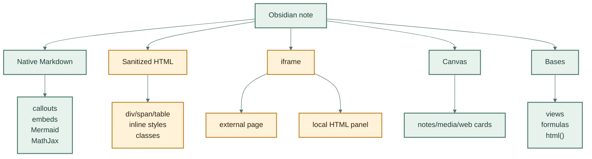

---
aliases:
  - Iframe And Clever Paths
tags:
  - experiment/obsidian
cssclasses:
  - obsidian-beauty-lab
---

# Iframe And Clever Paths

> [!summary]+ Что здесь проверяем
> **Цель:** понять, где Obsidian заканчивается как красивый Markdown и начинает
> быть оболочкой для мини-интерфейсов.
>
> Здесь есть гарантированные официальные возможности и отдельные пробы. Пробы
> специально оставлены рядом, чтобы глазами проверить поведение в конкретной
> версии Obsidian.

## Карта Возможностей



## Iframe: Внешняя Страница

> [!warning]- Ожидаемый риск
> Obsidian умеет вставлять web pages через `iframe`, но конкретный сайт может
> запретить встраивание своими заголовками безопасности. Если блок ниже пустой,
> это не обязательно ошибка Obsidian.

<div class="obl-frame-shell" style="margin: 18px 0 26px; padding: 14px; border-radius: 24px; background: linear-gradient(135deg, #fff8ec, #e7f2ed); border: 1px solid rgba(74,58,33,.15); box-shadow: 0 18px 54px rgba(48,39,26,.12);"><div style="display:flex; justify-content:space-between; gap:12px; align-items:center; margin:0 0 10px;"><strong>External iframe probe</strong><span style="font-size:12px; color:#675b4b;">may be blocked by target site</span></div><iframe src="https://obsidian.md" width="100%" height="380" style="border:0; border-radius:18px; background:#fff;"></iframe></div>

## Iframe: Локальная HTML-Панель

> [!tip]- Почему это интересно
> Если локальный HTML в iframe работает, Obsidian может быть оболочкой для
> маленьких интерактивных панелей: calculators, dashboards, visual inspectors,
> prototypes. Это уже не чистый Markdown и требует отдельной дисциплины.

<div class="obl-frame-shell" style="margin: 18px 0 26px; padding: 14px; border-radius: 24px; background: linear-gradient(135deg, #242a2f, #324841); border: 1px solid rgba(255,255,255,.14); box-shadow: 0 20px 58px rgba(20,25,28,.22);"><div style="display:flex; justify-content:space-between; gap:12px; align-items:center; margin:0 0 10px; color:#fff7e8;"><strong>Local HTML iframe probe</strong><span style="font-size:12px; color:#e9c77d;">try button inside</span></div><iframe src="file:///Users/triton/Documents/GitHub/agentic-research/experiments/obsidian-beauty-lab/web-panels/mini-control-room.html" width="100%" height="460" style="border:0; border-radius:18px; background:#111;"></iframe></div>

[Открыть локальную HTML-панель напрямую](file:///Users/triton/Documents/GitHub/agentic-research/experiments/obsidian-beauty-lab/web-panels/mini-control-room.html)

## Media Embed: Лёгкий Путь

Видео и social embeds иногда работают проще через Markdown image/embed-синтаксис.
Это красиво, но зависит от внешней платформы.

```md

```

## Bases: HTML Внутри View

Base-функция `html()` может рендерить HTML-кусок внутри view. Это не замена
странице, но хороший путь для бейджей, компактных статусов и визуальных
колонок.

![[iframe-and-html.base]]

## Canvas: Пространственная Оболочка

Canvas может держать note cards, media cards и web page cards. Это не “красивая
заметка”, а отдельная поверхность мышления: хорошо для карты, плохо для
канонического текста.

Открой рядом: [[01-beauty-board.canvas|Canvas-доска]].

## Что Потенциально Стоит Добавить В `1obsidian`

> [!success]+ Стоит добавить
> - Iframe как отдельный experimental route, не как default.
> - Локальный HTML panel pattern для прототипов, если ручная проверка покажет,
>   что Obsidian стабильно его открывает.
> - Bases `html()` как компактный способ делать красивые статусы без большого
>   HTML в заметке.

> [!danger]- Не стоит делать default
> - Большие HTML-блоки вместо Markdown.
> - JavaScript как скрытую обязательную часть project truth.
> - iframe с внешними сервисами как единственный рабочий интерфейс.
> - Canvas text cards как источник долгоживущей правды.

## Источники Для Проверки

- [Obsidian HTML content](https://obsidian.md/help/html)
- [Obsidian Embed web pages](https://obsidian.md/help/embed-web-pages)
- [Obsidian Canvas](https://obsidian.md/help/plugins/canvas)
- [Obsidian Bases functions](https://help.obsidian.md/bases/functions)
