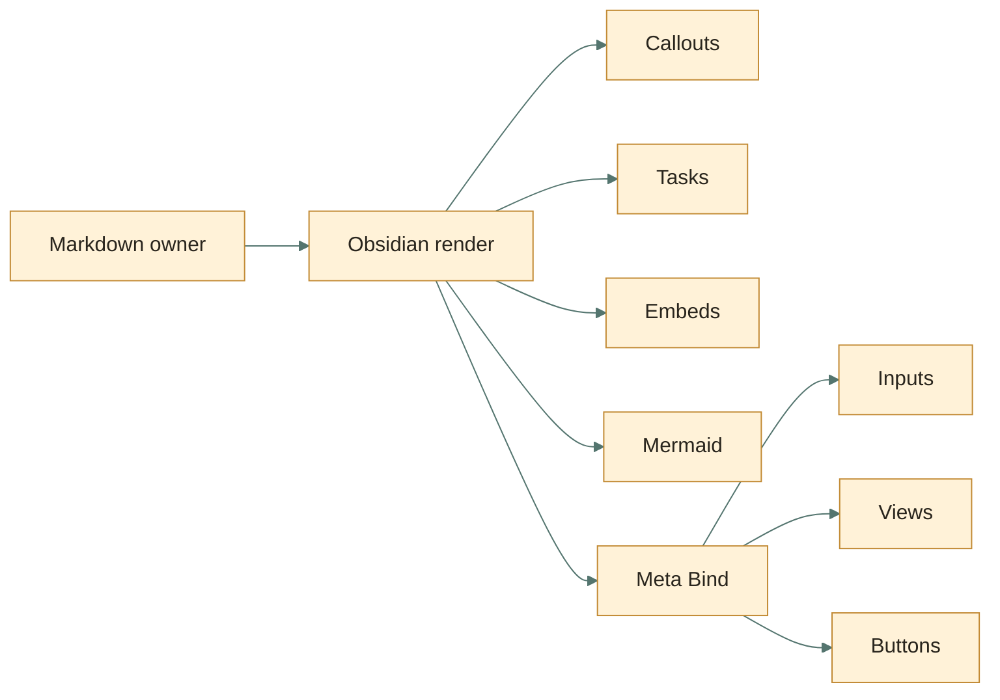

---
aliases:
  - Meta Bind And Obsidian Primitives
tags:
  - experiment/obsidian
  - experiment/meta-bind
cssclasses:
  - obsidian-beauty-lab
  - obsidian-primitives-lab
demo_title: Obsidian Control Surface
demo_done: false
demo_mode: playground
demo_priority: medium
demo_progress: 8
demo_count: 3
demo_rating: 4
demo_date: 2026-05-12
demo_note: Живая заметка остаётся Markdown, а UI только помогает.
demo_tags:
  - callouts
  - meta-bind
  - mermaid
  - checklists
  - properties
demo_list:
  - callouts
  - checkboxes
  - embeds
demo_suggestion: bases
---

# Meta Bind And Obsidian Primitives

> [!summary]+ Зачем этот лист
> Это широкая витрина возможностей Obsidian в одной заметке: Meta Bind controls,
> разные task-checkbox статусы, callouts, embeds, Mermaid, MathJax, query,
> tables, footnotes, HTML и links.
>
> Это **эксперимент**, не рабочая модель данных проекта. Если какой-то блок
> окажется полезным, потом отдельно решим, что стоит добавить в `1obsidian`.

<div class="obl-hero obl-mini-hero" style="margin: 18px 0 26px; padding: 26px; border-radius: 26px; border: 1px solid rgba(74,58,33,.16); background: radial-gradient(circle at 12% 16%, rgba(246,214,146,.55), transparent 32%), radial-gradient(circle at 88% 20%, rgba(118,176,165,.42), transparent 30%), linear-gradient(135deg, #fff8ec 0%, #edf7f2 100%);">
<div style="display:flex; flex-wrap:wrap; gap:10px; align-items:center; justify-content:space-between;"><strong style="font-size:22px;">Live note controls</strong><span style="padding:6px 10px;border-radius:999px;background:#2f6960;color:#fffaf1;font-weight:800;">Meta Bind installed</span></div>
<p style="margin:12px 0 0;color:#534a3d;max-width:720px;">Поля ниже должны редактировать frontmatter прямо из тела заметки. Если Meta Bind выключен, они останутся читаемыми как обычный Markdown-код.</p>
</div>

## Meta Bind: Inline Controls

| Тип           | Демо                                                                                                   | Что меняет             |
| ------------- | ------------------------------------------------------------------------------------------------------ | ---------------------- |
| toggle        | `INPUT[toggle:demo_done]`                                                                              | `demo_done`            |
| text          | `INPUT[text:demo_title]`                                                                               | `demo_title`           |
| number        | `INPUT[number:demo_count]`                                                                             | `demo_count`           |
| slider        | `INPUT[slider(minValue(0), maxValue(100)):demo_progress]`                                              | `demo_progress`        |
| progress      | `INPUT[progressBar(minValue(0), maxValue(100)):demo_progress]`                                         | тот же `demo_progress` |
| date          | `INPUT[datePicker:demo_date]`                                                                          | `demo_date`            |
| inline select | `INPUT[inlineSelect(option(low, low), option(medium, medium), option(high, high)):demo_priority]`      | `demo_priority`        |
| suggester     | `INPUT[suggester(option(callouts), option(bases), option(canvas), option(meta-bind)):demo_suggestion]` | `demo_suggestion`      |
| inline list   | `INPUT[inlineList:demo_list]`                                                                          | `demo_list`            |

> [!tip]- View fields
> **Title:** `VIEW[{demo_title}]`
>
> **Mode:** `VIEW[{demo_mode}]`
>
> **Progress:** `VIEW[{demo_progress}]`%
>
> **Tags:** `VIEW[{demo_tags}]`

## Meta Bind: Block Controls

```meta-bind
INPUT[textArea(title('Заметка'), placeholder('Короткая мысль или заметка')):demo_note]
```

```meta-bind
INPUT[multiSelect(
  option(callouts),
  option(checklists),
  option(properties),
  option(canvas),
  option(bases),
  option(iframe)
):demo_tags]
```

```meta-bind-button
label: "+1"
hidden: true
id: "obl-count-plus"
style: primary
actions:
  - type: updateMetadata
    bindTarget: demo_count
    evaluate: true
    value: "x + 1"
```

```meta-bind-button
label: "-1"
hidden: true
id: "obl-count-minus"
style: default
actions:
  - type: updateMetadata
    bindTarget: demo_count
    evaluate: true
    value: "x - 1"
```

```meta-bind-button
label: "Reset"
hidden: true
id: "obl-count-reset"
style: destructive
actions:
  - type: updateMetadata
    bindTarget: demo_count
    evaluate: false
    value: 0
```

```meta-bind-button
label: "Open Canvas"
hidden: true
id: "obl-open-canvas"
style: default
action:
  type: open
  link: "[[01-beauty-board.canvas]]"
```

**Counter:** `BUTTON[obl-count-minus, obl-count-reset, obl-count-plus]` `VIEW[{demo_count}]`

**Navigation:** `BUTTON[obl-open-canvas]`

> [!warning]- Button boundary
> Meta Bind buttons can run commands, create notes, update metadata and execute
> JavaScript when enabled. For this demo, active buttons only update local
> frontmatter or open a local file.

## Meta Bind Embed

```meta-bind-embed
[[controls/meta-bind-mini-panel]]
```

## Task Checkboxes

Obsidian core lets you toggle normal tasks in Reading view and treats any
character inside brackets as a completed/custom state. Theme or task plugins may
render custom symbols more beautifully.

- [ ] empty: ordinary open task
- [x] x: done
- [X] X: done, case-insensitive
- [?] ?: question / unsure
- [!] !: attention
- [-] -: canceled / removed
- [/] /: in progress
- [>] >: delegated / forwarded
- [<] <: scheduled / waiting
- [*] *: important

Nested tasks:

- [x] Parent task
  - [x] Done child
  - [x] Unknown child
  - [ ] Open child

## Callout Gallery

> [!note] note
> Neutral note.

> [!abstract]- abstract / summary / tldr
> Folded by default with `-`.

> [!info] info
> Context that should not dominate.

> [!todo] todo
> Active work or next action.

> [!tip] tip / hint / important
> Useful move or pattern.

> [!success] success / check / done
> Accepted result.

> [!question] question / help / faq
> Decision or uncertainty.

> [!warning] warning / caution / attention
> Risk that still lets work continue.

> [!failure] failure / fail / missing
> Something expected is absent.

> [!danger] danger / error
> Stronger failure or unsafe path.

> [!bug] bug
> Defect or surprising behavior.

> [!example] example
> Reusable pattern or demo.

> [!quote] quote / cite
> Quoted or source-like material.

> [!custom-beauty]+ Custom callout via CSS snippet
> This uses `data-callout="custom-beauty"` and only becomes special when
> `snippets/obsidian-beauty-lab.css` is active.

> [!question]+ Nested callout
> Can callouts contain callouts?
>
> > [!todo] Yes
> > Keep nested bodies short.
> >
> > > [!example] Third level
> > > This is possible, but easy to overuse.

## Embeds And Links

- Wikilink: [[00-obsidian-beauty-lab]]
- Heading link: [[02-iframe-and-clever-paths#Iframe Локальная HTML-Панель]]
- Alias link: [[01-beauty-board.canvas|Open Canvas board]]
- Embed a note heading:

![[02-iframe-and-clever-paths#Bases HTML Внутри View]]

- Embed a Base:

![[iframe-and-html.base]]

- Obsidian URI shape:

[Open this file](obsidian://open?file=experiments%2Fobsidian-beauty-lab%2F03-meta-bind-and-obsidian-primitives.md)

## Query Block

```query
path:experiments/obsidian-beauty-lab
```

## Tables, Math, Footnotes, Comments

| Surface | Strength | Risk |
| :-- | :--: | --: |
| Markdown | portable | low |
| Meta Bind | interactive | medium |
| iframe | powerful | high |

Inline math: $progress = \frac{42}{100}$.

Block math:

$$
\text{usefulness} = \frac{\text{clarity} + \text{control}}{\text{drift}}
$$

Footnote demo.[^meta-bind-note]

%% This comment is visible only in editing mode. %%

[^meta-bind-note]: Footnotes render in Reading view; inline footnotes behave differently in Live Preview.

## Mermaid Mini Map



## HTML Micro Widgets

<details class="obl-details" open><summary>Native details element</summary><p>This is plain HTML inside Markdown. It is useful for progressive disclosure, but should not hide project truth.</p></details>

<div class="obl-meter" style="margin: 14px 0; padding: 16px; border-radius: 18px; background: #fffaf1; border: 1px solid rgba(74,58,33,.14);">
<strong>HTML meter</strong><br>
<progress max="100" value="42" style="width:100%; height:18px; margin-top:10px;"></progress>
</div>

## External / Local Media Syntax

```md
![[local-image.png|320]]
![[document.pdf#page=2]]
![[audio-file.mp3]]
![[video-file.mp4]]

```

## Что Точно Проверить Глазами В Obsidian

> [!todo]+ Manual QA
> - Meta Bind controls update frontmatter.
> - Custom checkbox statuses look acceptable in the current theme.
> - `meta-bind-embed` renders the control block.
> - Query block does not make the page noisy.
> - CSS custom callout appears only when snippet is active.

## Источники

- [Obsidian callouts](https://obsidian.md/help/callouts)
- [Obsidian task lists](https://obsidian.md/help/syntax#Task%20lists)
- [Obsidian advanced syntax](https://obsidian.md/help/advanced-syntax)
- [Meta Bind docs](https://www.moritzjung.dev/obsidian-meta-bind-plugin-docs/)
- [Meta Bind input fields](https://www.moritzjung.dev/obsidian-meta-bind-plugin-docs/guides/inputfields/)
