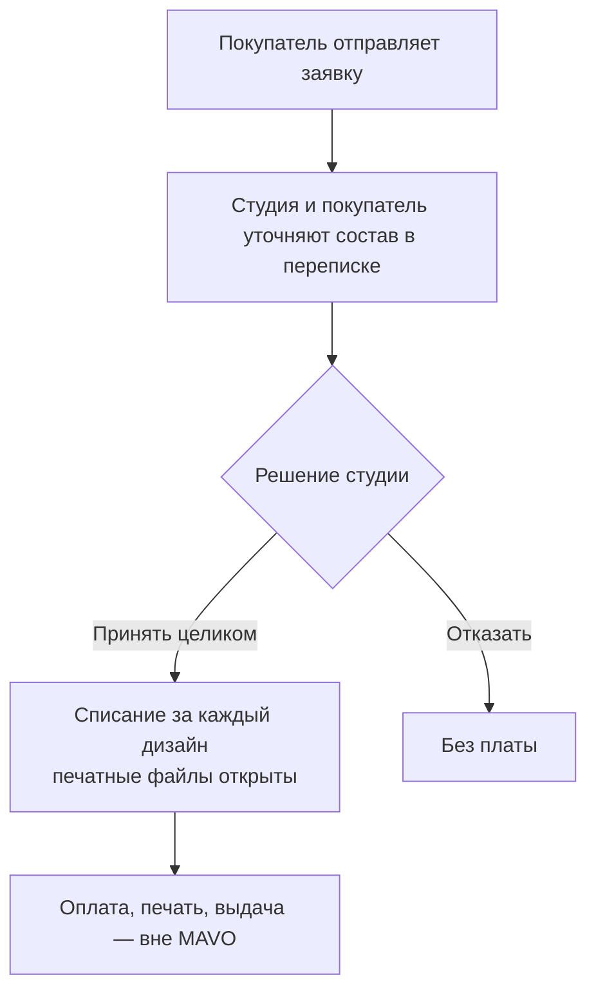

<!-- Образец формы и размера на материале проекта MAVO (2026-09-05), не правда проекта: числа и имена — для тона, не для переноса. -->

# Сценарий — Заявка

## Контекст

Покупатель настроил вещь на витрине своей студии и готов заказать. Студия ждёт заявку в кабинете и решает по ней сама: MAVO не арбитр и не касса. Единственное платное событие для студии — принятие.

## Ход

1. Покупатель отправляет заявку и получает вечную ссылку.
2. Студия уточняет состав в переписке и правит его.
3. Студия принимает заявку целиком: списание и открытие файлов происходят одним событием.
4. Дальше оплата, печать и выдача — вне MAVO.

## Критерии принятия

- Нет принятия — нет ни списания, ни файлов.
- Одно списание на каждый дизайн внутри заявки; тираж одинаковых — одно.
- После принятия состав заявки не меняется.
- Печатные файлы покупателю недоступны.
- Отказ бесплатен.
