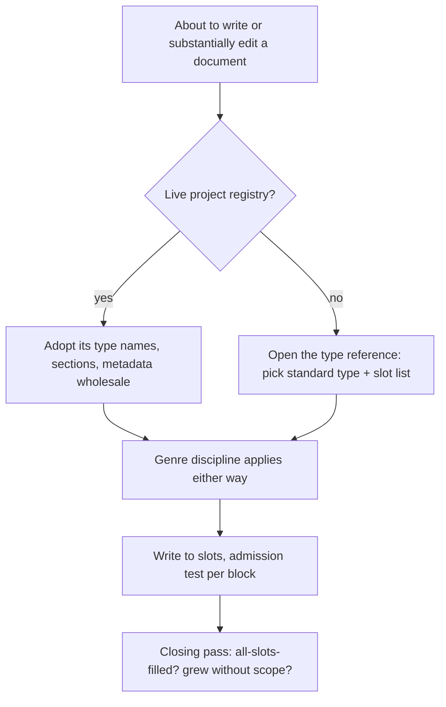

# Semantic draft — `1document-system` v2

Clean-room derivation from commander's intent only. Names WHAT must exist and
WHY; wording is not final.

**Working restatement of the function.** A document's type name is its address:
the next agent reads the filename and already knows the genre, the section
order, and therefore where the answer is — without opening the file. The same
type name is a stereotype that also carries corporate volume, so the skill
imports half the stereotype and refuses the other half.

---

## 1. Mechanisms that must exist

| # | Mechanism | The function fails without it because | Goals |
|---|---|---|---|
| 1 | **Type assigned before writing, carried in the filename** | An untyped file fires no stereotype: the agent writes prose and its own opinions, and nothing in the corpus is addressable by name. This is the failure the intent names first. | 2, 3 |
| 2 | **The type is a standard business-document term, never an invented label** | The entire value is the model's pre-existing prior. An invented type ("Payment Intelligence Brief") gives neither genre nor address — the name looks typed and carries nothing. This is also the reason the package is English: the priors are attached to the English terms. | 2, 3 |
| 3 | **The topic half of the name is a stable thing, not the occasion of writing** | Agent default is occasion-naming (`auth-refactor-notes-aug.md`). The type half then works and the topic half doesn't: the answer is unfindable, and the next agent writes a second file for the same answer. Pure sprawl, permanent. | 2 |
| 4 | **Existing-owner check before creating a file** | Sprawl has two sources — documents too big and documents too many. Goal 2 says one place per mutable answer; a new file for an answer that already has an owner creates the second place. The address makes this check nearly free, so there is no excuse to skip it. | 2 |
| 5 | **Owning-genre spine rule: every kind of content has one genre that owns it; content owned by another genre leaves this document** | This single rule is both goal 2 and goal 3. Opinions are not banned — they belong to a proposal or decision record. Chronicle is not banned — it belongs to a log or changelog. Banning them everywhere would suppress real content; binding each to its owning genre is what makes "one place per answer" decidable. | 2, 3 |
| 6 | **Explicit split of what the stereotype may supply: the map and the order, never the length, the ceremony, or the register** | The owner's core complaint. Without the split the address and the corporate volume arrive as one package, because they are one package in the model's prior. See §2. | 1 |
| 7 | **Sections are ordered slots with optional presence — never a template** | A template is the coverage generator in physical form: sections demand content and the agent invents it. Fixed order preserves the address; optional presence removes the demand. Absence of a heading is itself the answer: this document has no answer of that kind. | 1, 2 |
| 8 | **Named never-present section families** (provenance/status/revision; summary/intro/background/conclusion; scope preamble/glossary-as-section/appendix) | These survive every soft rule because they read as structure, not content, so an admission test at block level does not bite them. They are also the front doors: provenance is how chronicle enters a specification, summary is how restatement enters everything. One unit, named list, high yield. | 1, 3 |
| 9 | **Per-block admission test: name the action the block enables or the question it answers, in a few words, or it does not enter** | "Be concise" is not decidable and invites compression instead of removal. This test is decidable, it is the owner's own criterion, and it is the only stop for justification prose and recap — the two generators that produce well-formed, on-topic, useless volume. | 1 |
| 10 | **Displacement on substantial edit: superseded text is removed, not annotated** | The default on "edit this document" is append — non-destructive, safe-feeling, and the entire bloat engine on the edit path. Result: monotone growth, contradictory strata, and chronicle by accretion ("previously X, now Y"). Goal 3 names this directly: growth without displacement is not success. | 1, 3 |
| 11 | **Precedence: genre discipline never yields; type names, section vocabulary and metadata yield wholesale to a live project registry** | Two failures, both material. Imposing the skill's vocabulary on a project that has one puts two naming systems in one corpus and destroys the address — the exact thing the skill exists to protect. Reading a local documentation contract as license to skip genre discipline loses everything else. "Wholesale" matters: merging the two vocabularies is the same failure as ignoring the local one. | 2, 3 |
| 12 | **A test for what counts as a live registry** | Without it the yield rule is unusable: the agent cannot distinguish a project contract from a stale file, and will either over-yield to an abandoned convention or under-yield and invent. | 2 |
| 13 | **Closing pass with two observable signals: every slot filled; volume grew with no new scope** | Drift is late-draft — the stereotype reasserts itself after the first sections, and models are reluctant to delete their own output, so prevention alone does not hold. These two signals are non-arbitrary, derived from the owner's two stated anti-goals, and checkable against the finished file rather than against the agent's self-report. | 1, 3 |

Thirteen mechanisms; every row serves at least one goal. Mechanisms 11 and 12
are separately violable (one can accept the precedence rule and still misread
what a registry is), so they are counted separately.

---

## 2. Startup volume without losing the address

This is the load-bearing section. The problem is not that documents are long.
The problem is that the one instruction that buys the address — the type name —
is the same instruction that buys the volume, because in the model's prior they
are inseparable.

### Why the volume rides along

A frontier model's prior for "specification" or "runbook" is trained on
enterprise artifacts written for **an audience that is not present**: reviewers,
approvers, auditors, future hires, occasionally lawyers. Serving an absent
audience produces four distinct volume generators:

| Generator | What it produces | Leaks into |
|---|---|---|
| **Coverage** — a professional document fills its template; empty sections read as incompleteness | Invented content under Assumptions, Risks, Non-Goals, Open Questions | Goal 1 directly; the owner named it: "a full set of sections filled for coverage is not success" |
| **Justification** — the document must defend its own choices to someone who will push back | Rationale prose in a genre that records what is, not why | Goal 1 and goal 3's opinion ban |
| **Provenance** — the document must prove its own legitimacy | Revision history, status, version, approvals, "as of the Q3 review" | Goal 3's chronicle ban |
| **Restatement** — the reader will read only part, so repeat the point | Executive summary, introduction, background, conclusion | Goal 1 |

Each generator is well-formed, on-topic and useless. None is caught by "write
concisely", because each one is *doing its job* under the corporate frame.

### The reframe that does the work

**Keep the stereotype's map. Discard the stereotype's audience.**

All four generators exist to serve a reader who is absent and cannot ask. The
startup document has a present actor who acts today and can ask a question.
Removing the absent reader removes the reason for all four generators at once —
which is why this belongs in the skill's Unique Context as a frame, not as four
prohibitions. It is also why the register (hedging, passive voice, corporate
throat-clearing) needs no rule of its own: it is downstream of the audience
frame and disappears with it.

### The four concrete devices

| Device | Kills | Why it preserves the address |
|---|---|---|
| **The stereotype is consulted for two questions only: what facts belong in this genre, and in what order.** It is not consulted for how long, which ceremonial sections, or what register. | The stereotype's authority over volume | The two questions it still answers *are* the address |
| **Ordered slots, optional presence.** A slot list is not a template: order is fixed so the reader can scan for a heading, presence is content-driven so nothing demands filling. A missing heading means the document has no answer of that kind — that is information, not a gap. | Coverage | Fixed order is exactly what makes the address work; the intent's "the agent knows in advance which section to look in" survives intact |
| **Per-block admission: name the action this block enables or the question it answers.** If the answer takes more than a few words, the block does not enter. | Justification, restatement | Blocks that answer a question are the blocks the address points at |
| **Named never-present families**, listed once: provenance/status/revision; summary/intro/background/conclusion; scope preamble, in-document glossary, appendix. | Provenance, and the residue of the other three | These carry no answers, so removing them removes no address |

Mechanism 10 (displacement) is the same discipline on the edit path: without it,
a document that obeys all four devices at birth still doubles in size across
five edits while its truth stays constant.

### Three tools deliberately refused

- **Length numbers per type.** Arbitrary across projects, and they create the
  opposite failure — padding up to the number, truncating real content at it.
  Startup volume is defined by need, not by count.
- **Compression as the fix.** Shortening sentences hides volume instead of
  removing it, and leaves every ceremonial block in place, merely tighter.
  Removal is the operation; compression is the tell that the wrong operation
  was chosen.
- **Templates or skeleton files to copy.** A template is the coverage generator
  in physical form and would be the single largest source of the bloat the
  owner is complaining about. The reference ships slot *lists*, and the
  distinction is stated where the list is used, not only where it is defined.

### How volume becomes observable

Two signals, both non-arbitrary and both read off the finished file:

- **Every slot filled** is the coverage signature. Not automatically wrong, but
  it triggers a re-run of the admission test on each block, because the
  probability that one document genuinely holds every kind of answer its genre
  can hold is low.
- **Volume grew and no new scope entered** means displacement did not happen.
  Straight from goal 3's "a corpus that grew without displacing text is not
  success."

Both are checks on the artifact, not on the agent's account of itself.

---

## 3. Deliberately not in the skill

| Excluded | Reason |
|---|---|
| **Folder and path placement rules** | The address is the filename; filename search crosses folders. Every project owns its layout, so a placement rule would collide with most projects and would yield anyway under mechanism 11. |
| **An index or map document of the corpus** | The obvious reach, and it defeats the mechanism: goal 2 requires finding the place *without opening extra files*, and an index is an extra file — one that also goes stale and becomes a second place. The filename is the index. |
| **Length numbers, word budgets, section counts** | See §2. |
| **Register, tone and voice rules** | Downstream of the audience frame; a strong model that has dropped the absent reader does not write "it should be noted that." Cheap to violate, cheap in consequence, and it would compete for units against mechanisms that are not derivable. |
| **Markdown formatting conventions** (heading depth, tables vs lists, link syntax) | Obvious to a frontier model, and owned by the project. |
| **Guidance on writing good content within a genre** (how to phrase a requirement, how to structure a runbook step) | This is precisely what the stereotype supplies for free. Supplying it again pays for what is already there and re-imports the corporate template through the back door. |
| **Versioning, changelog and status metadata on documents** | Git holds provenance. These are the chronicle front door, and a changelog is its own genre with its own file. |
| **Ownership, authorship and approval fields** | Absent-reader artifacts with no action attached. |
| **A review or approval loop for finished documents** | The moment of invocation is writing. A review protocol is a separate contract and would roughly double the package. |
| **Corpus-wide retyping or migration** | The moment is one document. Retyping a single document during a substantial edit is in scope; sweeping an existing corpus is a different operation that would not fit the unit budget and is rarely what is being asked. |
| **Non-document artifacts** (code comments, commit messages, PR bodies, chat) | Ephemeral text has no address problem and no corpus to sprawl. |
| **Required metadata fields generally** | Derivation produced none that earn their place. Type plus topic in the filename gives the address; genre plus topic decides what belongs. The one survivor is narrow: when the filename is fixed by convention and cannot carry the type, the type is declared in the document's first line. (The owner's yield clause covers metadata, and it still applies — a project registry that mandates front matter is adopted wholesale.) |

---

## 4. Package form

**Body plus one reference.**

| File | Owns | Units | Progressive-disclosure justification |
|---|---|---|---|
| `SKILL.md` (body) | Unique Context (the stereotype trade and the absent-reader frame), the three goals, and mechanisms 1, 3, 4, 5, 6, 7 (rule form), 8, 9, 10, 11, 12, 13, plus the fixed-filename case and the condition for opening the reference | ~14–15 | Always needed. Every unit here is read on every invocation, and the closing pass in particular must be unavoidable — a check that lives out of sight is a check that a tired agent skips at the end of a long draft. |
| `references/document-types.md` | Mechanism 2 and the payload of 7: the table of standard types (what mutable answers each owns → its ordered slot list), the rule that the closest standard term beats a more precise invented one, and the slot-list-is-not-a-template statement at point of use | ~6 units plus one table | Genuinely conditional. It is not opened when the project has a live registry (mechanism 11 sends the agent to the project's own vocabulary) nor when the corpus has already fixed the type and slots for this document. It is also the largest token payload in the package, so keeping it out of the always-loaded body is where progressive disclosure actually pays. |

**Stage boundaries of the reference** — input: no live project registry, and the
type or slot list is not already fixed by the corpus. Output: this document's
type name and its ordered slot list. Self-contained: executable from the body
plus this file, opening no third file.

**Representative type set for the table** (final set to be settled when the
package is written): specification · design/decision record · proposal ·
runbook / standard operating procedure · reference · guide (how-to) · policy ·
report / analysis · plan · charter / brief · log / changelog · glossary ·
README / entry point.

The set is chosen so that every content kind the spine rule can displace has a
destination: decision record and proposal own rationale and opinion, log and
changelog own chronicle, report owns findings-at-a-point-in-time, glossary owns
definitions. Without those destinations the genre bans would read as "delete
this content", which is wrong and which agents correctly resist.

**Why not a second reference for the closing pass** — it is roughly four units,
it is never conditionally irrelevant, and its value depends entirely on being
in front of the agent at the moment the draft is finished. Only content that is
both large and conditionally irrelevant earns a file.

---

## 5. Open questions for the owner

1. **Documents whose filename is fixed by convention** — `README.md`,
   `AGENTS.md`, `CLAUDE.md`, `CONTRIBUTING.md`. They are project documents,
   they are substantially edited often, and their names cannot carry a type.
   Draft position: they get the genre half in full, and declare the type in the
   first line. Confirm, or exclude this class from the naming mechanism
   entirely?

2. **Where the type sits in the filename** — suffix (`auth.spec.md`), prefix
   (`spec-auth.md`), or folder. All three preserve the address but they group
   differently in a directory listing: suffix groups by topic, prefix groups by
   type. This only binds in projects with no registry of their own, but there it
   binds permanently. Draft default: suffix, because the topic is what an agent
   searches for and the type is the disambiguator.

3. **How far the skill may go on documents the owner wrote himself.**
   Displacement is the one mechanism that deletes existing text. Draft position:
   the genre bans apply to what the agent adds, but retyping or reshaping an
   owner-authored document is a change to the owner's artifact and needs his
   call. Without a boundary here, "displacement" authorizes an agent to rewrite
   the owner's own text on any substantial edit.
