# Mermaid Syntax For Obsidian

Краткая шпаргалка по Mermaid-синтаксису для `1writing-style`. Используй её, когда
создаёшь или правишь Mermaid-блок в Obsidian и не уверен в точной форме записи.
Obsidian может отставать от текущих Mermaid docs, поэтому после нового паттерна
проверяй черновик глазами.

## Общий Block

````md
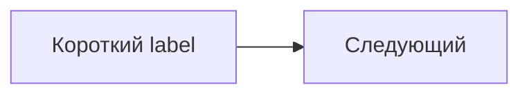
````

Правило Obsidian: короткие labels, без markdown-списков внутри узлов, длинный
смысл рядом обычным Markdown.

## Direction / Layout

Для `flowchart`:

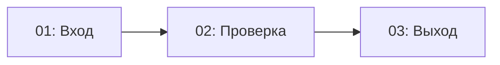

Варианты направления: `TB`/`TD`, `BT`, `LR`, `RL`. Горизонтально держи 3-4
коротких блока; больше — вертикально или дробить.

Для `gitGraph` направление задаётся после типа:

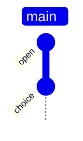

## Flowchart: New Shapes

Новая форма задаётся через `id@{ shape: ..., label: "..." }`.

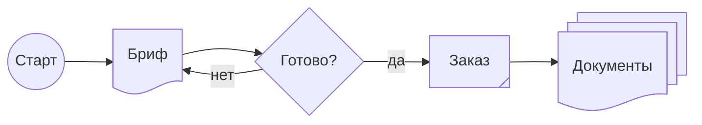

Полезные shapes: `rounded`, `doc`, `docs`, `diamond`, `tag-rect`, `database`,
`circle`, `hex`, `stadium`, `text`, `process`.

## Flowchart: Manual Snake

Mermaid не делает автоматический wrap строк. Ручная змейка работает через
несколько `subgraph` с разными `direction`, но это хрупкий вариант.

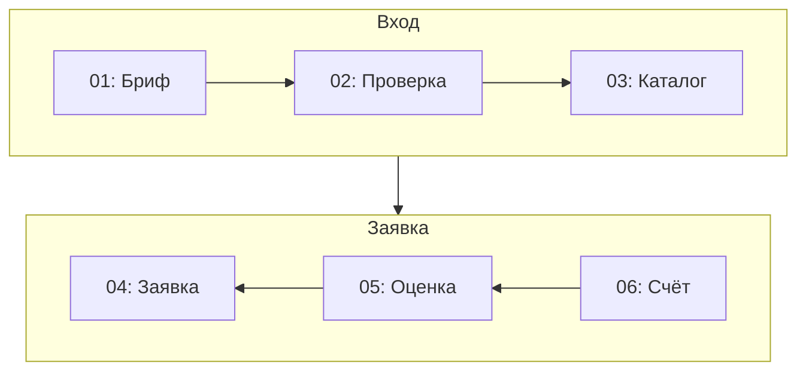

## SequenceDiagram

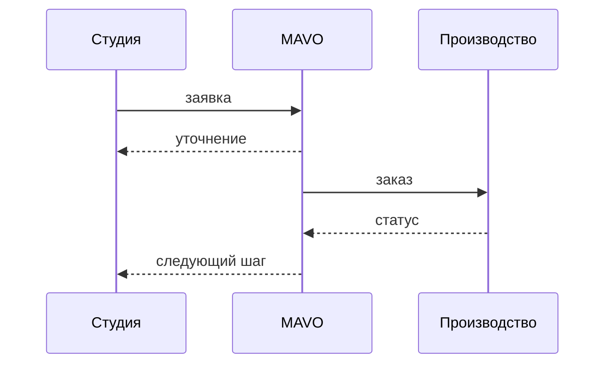

Для длинного пояснения используй `Note`, а не огромный текст на стрелке:

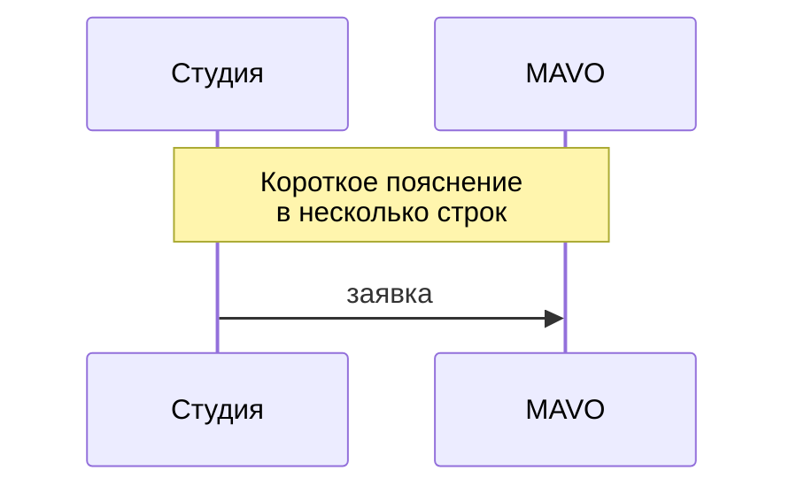

## QuadrantChart

Русские и многословные labels бери в кавычки.

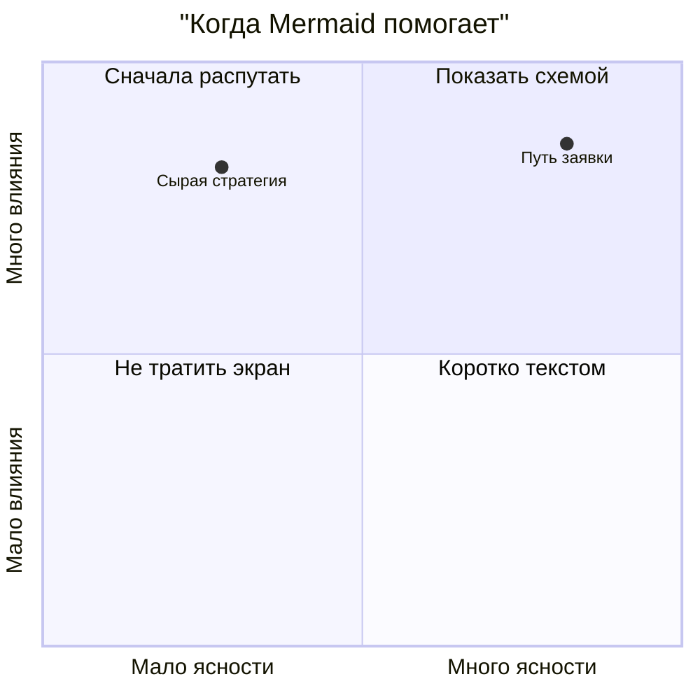

## Pie

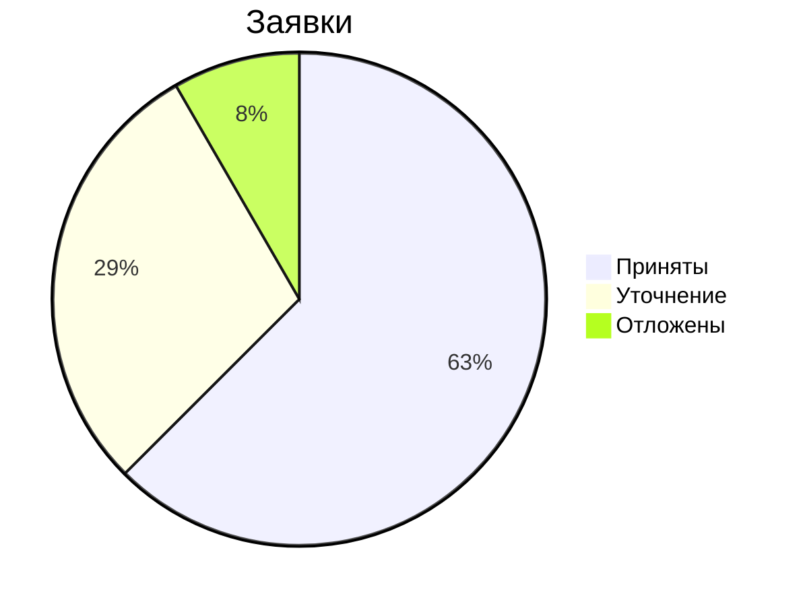

## GitGraph

GitGraph полезен для развилки пути, не только для Git. Держи `id` короткими.

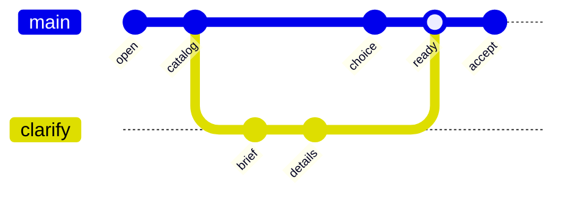

Дополнительно:

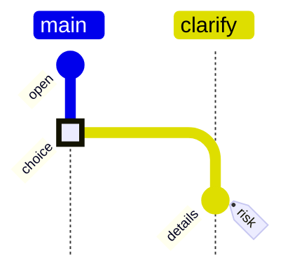

## Kanban

Колонка: `id[Title]`. Задача внутри колонки: `taskId[Task title]`.

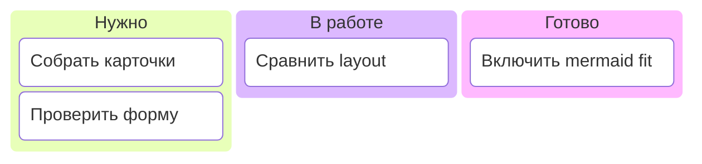

Metadata есть, но в Obsidian лучше не усложнять без нужды:

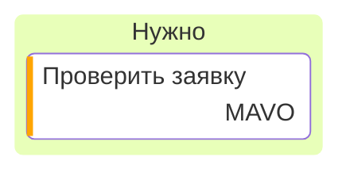

## Mindmap

Mindmap строится от отступов. Самая частая ошибка — сломать иерархию
неодинаковыми отступами.

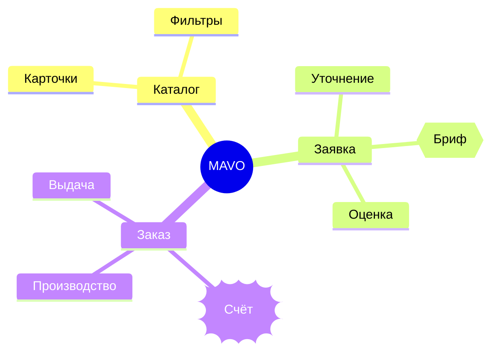

Полезные формы: `id[квадрат]`, `id(rounded)`, `id((circle))`,
`id{{hexagon}}`, `id))bang((`, `id)cloud(`.

Иконки в mindmap (`::icon(...)`) считаются experimental; в Obsidian не обещай
их без проверки.

## Theme Frontmatter

Для новых Mermaid версий предпочтительнее frontmatter config, а не старые
`%%{init: ...}%%` directives. В Obsidian всё равно проверяй глазами.

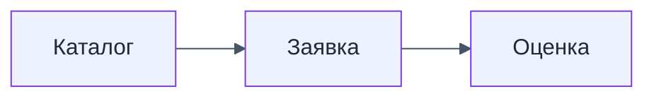

Допустимые базовые themes в docs: `default`, `base`, `dark`, `forest`,
`neutral`. Для кастомных цветов используй `base`.

## classDef / linkStyle

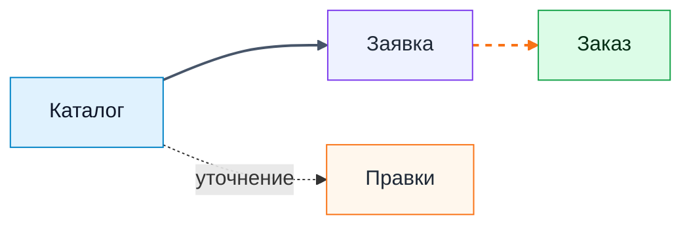

## ELK Layout

ELK — эксперимент в Obsidian. Парсер может принять config, но визуально
рендериться как обычный `dagre`.

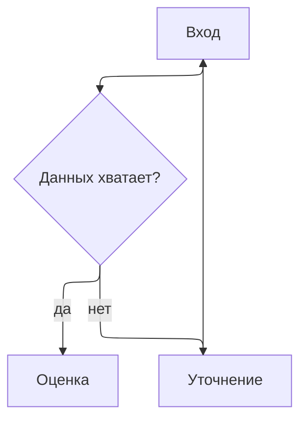

Если ELK не даёт явной визуальной пользы, дроби схему на несколько Mermaid.

## Источники

- Mermaid Flowchart docs: https://mermaid.js.org/syntax/flowchart.html
- Mermaid Sequence Diagram docs: https://mermaid.js.org/syntax/sequenceDiagram.html
- Mermaid Quadrant Chart docs: https://mermaid.js.org/syntax/quadrantChart.html
- Mermaid Pie docs: https://mermaid.js.org/syntax/pie.html
- Mermaid GitGraph docs: https://mermaid.js.org/syntax/gitgraph.html
- Mermaid Kanban docs: https://mermaid.js.org/syntax/kanban.html
- Mermaid Mindmap docs: https://mermaid.js.org/syntax/mindmap.html
- Mermaid Theme docs: https://mermaid.js.org/config/theming.html
- Mermaid Layout docs: https://mermaid.js.org/config/layouts.html
- Mermaid Directives docs: https://mermaid.js.org/config/directives.html
