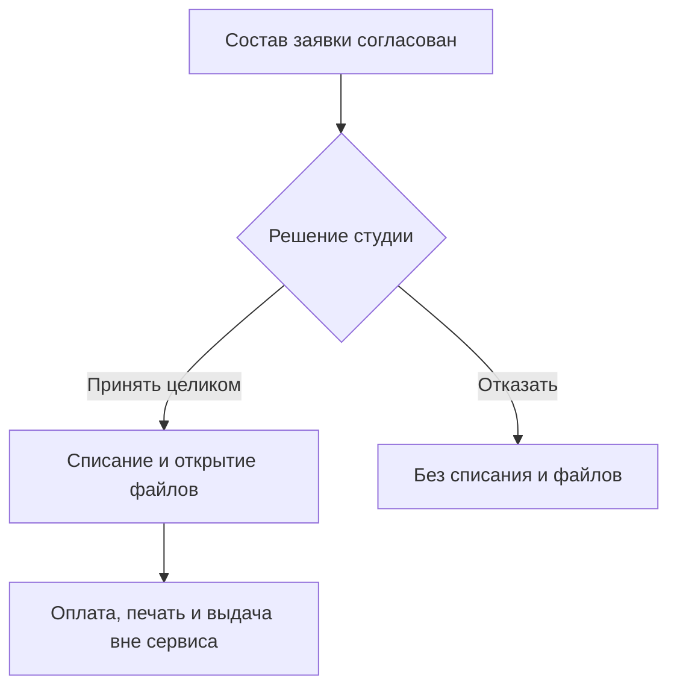

# Написание сценария

Вход: утверждённый порядок взаимодействия ролей и выбранный дом.
Выход: файл «Сценарий — предмет» с разделами «Контекст», «Ход»,
«Критерии принятия».

## Задача

Вырази ход событий, через который роли достигают принятого результата.

## Цель

Строителю понятны изменения обязательств на протяжении сценария, а выбор
экранов и кликов остаётся решением реализации.

## Зачем

Порядок денежных событий, изменений доступа и сохранения данных дорого
переделывать. Экранный маршрут скрывает эти переходы за кнопками и позволяет
реализовать удобный интерфейс с другой моделью продукта.

## Форма смысла

- Контекст объясняет исходную ситуацию и её участников; Ход содержит события
  между ролями. Событие, меняющее деньги, доступ или данные, называет это
  изменение словами, чтобы момент не выбирался по удобству кода.
- Порядок выражается нумерованным списком. Развилка может быть вертикальной
  Mermaid-схемой; одинаковое содержание списка и схемы не дублируется.
- Критерии закрывают существенный обходной путь, отказ или повтор события:
  успешного маршрута недостаточно, если альтернативный меняет обязательства.

Новое уточнение меняет связанный ход и критерии как одно целое. Совместимость
со связанными целями и фактами проверяется по состояниям участников, а не по
похожести названий шагов; существенное неизвестное не заполняется предположением.

## Пример формы

Учебный пример, не правило текущего проекта. Схема здесь полностью выражает
ход, поэтому отдельный список тех же событий не нужен.

````markdown
---
description: "Принятие заявки студией, списание и открытие печатных файлов."
aliases: []
---
# Сценарий — Принятие заявки

## Контекст

Студия и покупатель уточнили заявку в переписке. Сервис открывает студии
печатные файлы при принятии; расчёты с покупателем и производство остаются
за пределами сервиса.

## Ход



## Критерии принятия

- Списание и открытие файлов — одно неделимое событие.
- Повтор принятия не создаёт второго списания.
- Принятый состав заявки не меняется.
- Покупатель не получает печатные файлы.
````
